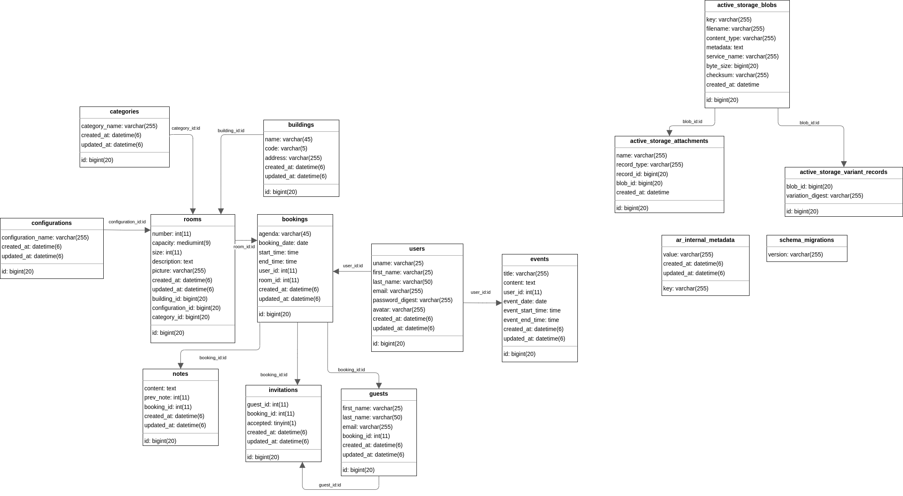

# Conference Room (with Ruby on Rails)

The purpose of this web application is for me to use Ruby on Rails to design and construct the core interface for a
meeting room booking website. This, and many other similar projects I develop, serve as a learning environment for
various software development principles. As a result, these are some of the thoughts I used to create this web
application:

## Back-end Programming in Ruby

Rails is the programming framework that was utilized to design and maintain this web application, as the project name
suggests. It offers tremendous web development tools when combined with the Ruby programming language, which I am eager
to master.

### The Database

Because I'm using Manjaro (a Linux Distro based on Arch Linux), I picked mariaDB as the relational database management
system (RDBMS). In the RDBMS, I created a specific user for this web application and provided it access to the database
schema. I wrote the data migration classes in Rails to generate the schema and all of the tables that go with it.

#### Application models' Entity-Relationship Diagram (ERD)

### Testing the App

For testing, I set up the required database environment and utilized fixtures, which are essentially fancy words for
sample data, according to the Rails handbook. I also attempted to use the "Red, Green, Refactor" test-driven development
paradigm. So I first wrote the tests, which by default fail, and then I wrote code to pass those tests. Finally, I
refactored the written code to improve its readability and maintainability.

### Object-oriented Programming

Since my first days at university, I've learned that encapsulating data using objects makes your application more
stable, robust, and modular, which is precisely what I want for my project.

When establishing an application with Rails, the MVC pattern is automatically included. The table columns are defined as
instance members in all models, which are Ruby classes. So all I had to do was build on top of the object-oriented
paradigm that was already there.

## Front-end Programming

### Form validation in JavaScript

### HTML ERB Templating

